# Appendix III --- Listings (Hybrid)

This appendix preserves the original program listings as **page images**
and provides a **best-effort cleaned Pascal transcription** beneath each
page.

-   The images are the authoritative source.
-   The code blocks are reconstructed from OCR and lightly corrected for
    readability.
-   Any uncertain reconstructions are marked inline with
    `[[uncertain: …]]`.

## Listing section title (original)

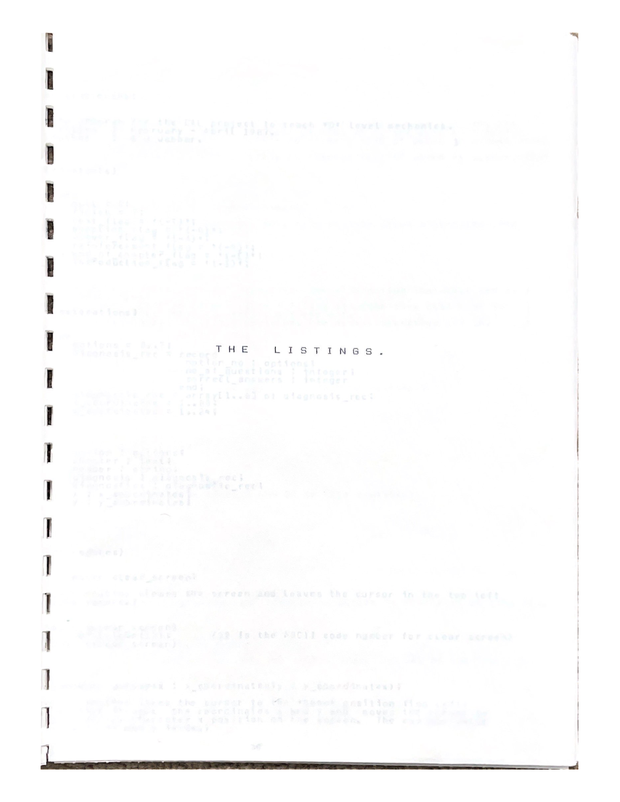

## Listings pages (original + transcription)

### Listing page 1

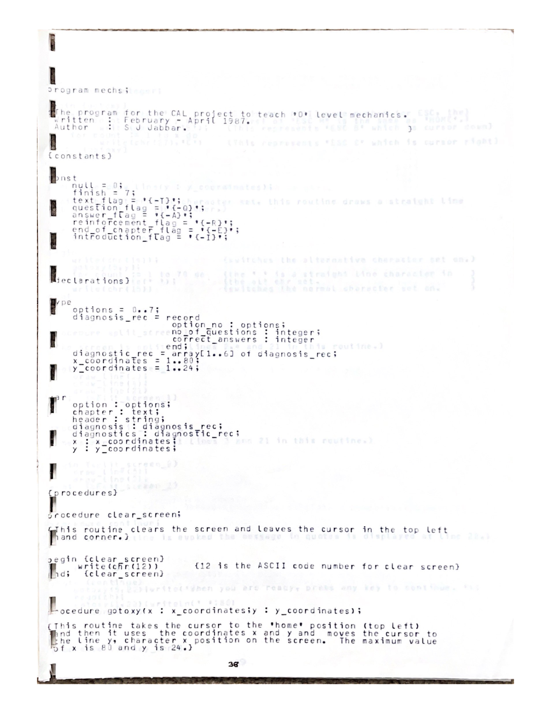

``` pascal
{ Page 1 transcription covers: program header, constants/types/vars, and basic screen procedures. }

{ NOTE: Some terminal control details and line-drawing characters are marked uncertain. }

program mechs;
{ The program for the CAL project to teach O-level mechanics.
  Written February–April 1987.  Author: S. J. Jabbar. }

{ constants }
const
  null  = 0;
  finish = 7;

  text_flag          = '{-T}';
  question_flag      = '{-Q}';
  answer_flag        = '{-A}';
  reinforcement_flag = '{-R}';
  end_of_chapter_flag= '{-E}';
  introduction_flag  = '{-I}';

type
  options = 0..7;

  diagnosis_rec = record
    option_no        : options;
    no_of_questions  : integer;
    correct_answers  : integer;
  end;

  diagnostic_rec = array[1..6] of diagnosis_rec;

  x_coordinates = 1..80;
  y_coordinates = 1..24;

var
  option     : options;
  chapter    : text;
  header     : string;
  diagnosis  : diagnosis_rec;
  diagnostics: diagnostic_rec;
  x          : x_coordinates;
  y          : y_coordinates;

{ procedures }

procedure clear_screen;
{ Clears the screen and leaves the cursor in the top-left corner. }
begin
  write(chr(12));  { ASCII code for clear screen }
end;

procedure gotoxy(x: x_coordinates; y: y_coordinates);
{ Moves the cursor to line y, character x (GT100 terminal control). }
var
  count: integer;
begin
  write(chr(27), 'H');        { ESC H = HOME }
  for count := 1 to y do
    write(chr(27), 'B');      { ESC B = cursor down }
  for count := 1 to x do
    write(chr(27), 'C');      { ESC C = cursor right }
end;

procedure draw_line(y: y_coordinates);
{ Using the alternative character set, draw a horizontal line on line y. }
var
  count: integer;
begin
  write(chr(14));             { switch alternative character set on }
  gotoxy(5, y);
  for count := 1 to 70 do
    write('*');               { [[uncertain: line-drawing char in alt set]] }
  write(chr(15));             { switch normal character set on }
end;

procedure split_screen_1;
{ Split the screen at lines 2, 4 and 21. }
begin
  draw_line(2);
  draw_line(4);
  draw_line(21);
end;

procedure split_screen_2;
{ Split the screen at lines 3 and 21. }
begin
  draw_line(3);
  draw_line(21);
end;

procedure continue;
{ Prompt user to continue. }
var
  ch: char;
begin
  gotoxy(5, 22);
  write('When you are ready, press any key to continue.');
  read(ch);
  gotoxy(1, 22);
  writeln(' ':80);
end;
```

### Listing page 2

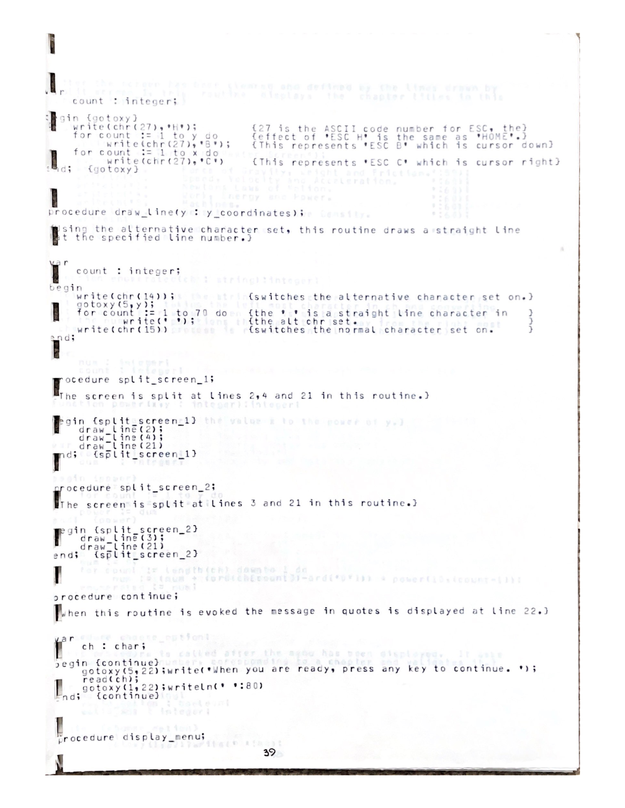

``` pascal
{ [[placeholder]] Next chunk will continue from this point: menu display and utility functions (e.g., display_menu, power, enumerated, choose_option, etc.). }
```


## Continuing transcription (menu + file handling + frame display)

### Listing page 4

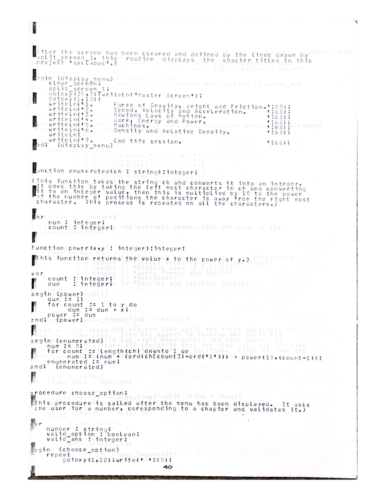

```pascal
{ This chunk reconstructs the menu display, basic numeric parsing, option selection, file opening, headers,
  and core frame/question display routines. Uncertainties are flagged inline where relevant. }

procedure display_menu;
{ After the screen has been cleared and defined by split_screen_1,
  this routine displays the chapter titles in the project syllabus. }
begin
  clear_screen;
  split_screen_1;

  gotoxy(30, 3);
  writeln('Master Screen');

  gotoxy(1, 10);
  writeln('1. Force of Gravity, Weight and Friction.');
  writeln('2. Speed, Velocity and Acceleration.');
  writeln('3. Newton''s Laws of Motion.');
  writeln('4. Work, Energy and Power.');
  writeln('5. Machines.');
  writeln('6. Density and Relative Density.');
  writeln;
  writeln('7. End this session.');
end;

function power(x, y: integer): integer;
{ Returns x to the power of y. }
var
  count: integer;
  dum  : integer;
begin
  dum := 1;
  for count := 1 to y do
    dum := dum * x;
  power := dum;
end;

function enumerated(ch: string): integer;
{ Converts a numeric string to an integer. }
var
  num  : integer;
  count: integer;
begin
  num := 0;
  for count := length(ch) downto 1 do
    num := num + (ord(ch[count]) - ord('0')) * power(10, count - 1);
  enumerated := num;
end;

procedure choose_option;
{ Called after the menu is displayed. Prompts the user for a chapter
  number and validates it. }
var
  number     : string;
  valid_option: boolean;
  valid_ans  : integer;
begin
  repeat
    gotoxy(1, 22); write(' ':80);
    gotoxy(5, 22); write('Type in the number of the chapter you require: ');
    readln(number);

    valid_ans := enumerated(number);
    valid_option := (valid_ans >= 1) and (valid_ans <= 7);
  until valid_option;

  if valid_ans = 7 then
    option := finish
  else
    option := valid_ans;
end;

procedure open_file;
{ Reset the variable 'chapter' to the relevant CHAPTER file. }
begin
  case option of
    1: reset(chapter, 'CHAPTER#01');
    2: reset(chapter, 'CHAPTER#02');
    3: reset(chapter, 'CHAPTER#03');
    4: reset(chapter, 'CHAPTER#04');
    5: reset(chapter, 'CHAPTER#05');
    6: reset(chapter, 'CHAPTER#06');
  else
    { no-op }
  end;
end;

procedure set_header;
{ Assign 'header' to the title of the current chapter. }
begin
  case option of
    1: header := 'Force of Gravity, Weight and Friction';
    2: header := 'Speed, Velocity and Acceleration';
    3: header := 'Newton''s Laws of Motion';
    4: header := 'Work, Energy and Power';
    5: header := 'Machines';
    6: header := 'Density and Relative Density';
  else
    header := '';
  end;
end;

procedure display_frame(flag: string);
{ Reads chapter text until the first occurrence of 'flag'.
  Then displays frames of up to 15 lines until the second occurrence. }
var
  line: string;
  pnum: integer;
  lnum: integer;
begin
  repeat
    readln(chapter, line)
  until line = flag;

  readln(chapter, line);
  pnum := 0;

  while line <> flag do
  begin
    clear_screen;
    split_screen_1;

    pnum := pnum + 1;
    gotoxy(5, 3);  writeln(header);
    gotoxy(65, 3); writeln('Page ', pnum:2);

    gotoxy(1, 5); writeln;

    lnum := 1;
    while (lnum <= 15) and (line <> flag) do
    begin
      writeln(' ':10, line);
      readln(chapter, line);
      lnum := lnum + 1;
    end;

    continue;
  end;
end;

procedure display_question(qnum: integer);
{ Displays a single question frame, delimited by question_flag markers. }
var
  line: string;
begin
  repeat
    readln(chapter, line)
  until line = question_flag;

  readln(chapter, line);

  clear_screen;
  split_screen_1;

  gotoxy(5, 3);
  writeln('Question ', qnum:1);

  gotoxy(1, 5); writeln;

  while line <> question_flag do
  begin
    writeln(' ':10, line);
    readln(chapter, line);
  end;
end;

procedure present_text;
{ Displays the frames of text using display_frame. }
begin
  display_frame(text_flag);
end;
```

### Listing page 5

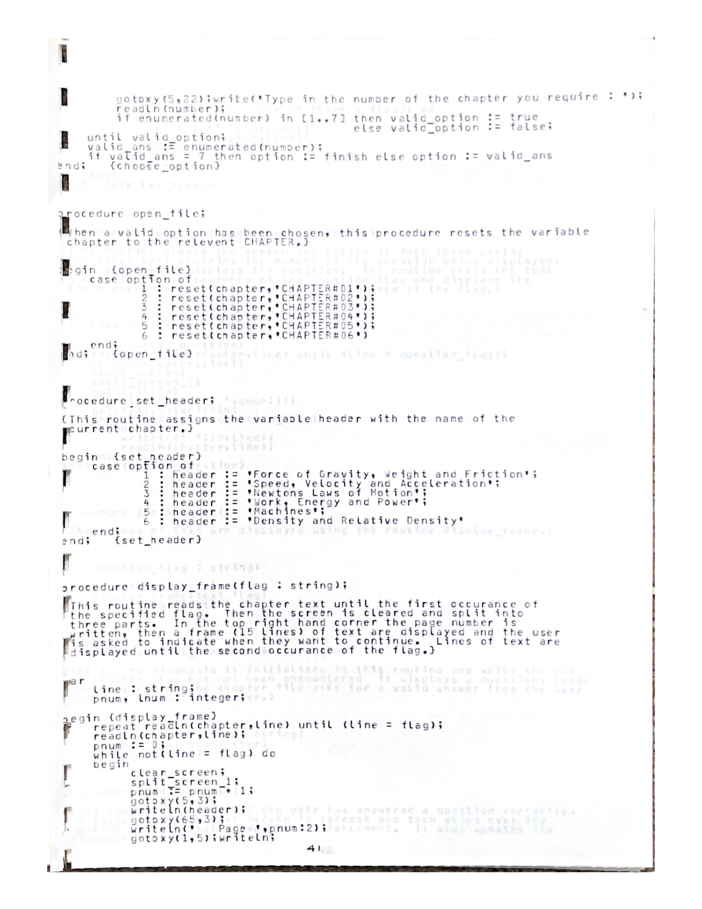

```pascal
{ [[placeholder]] The transcription for this page will be expanded in the next chunk; see the image above as the authoritative source. }
```

### Listing page 6

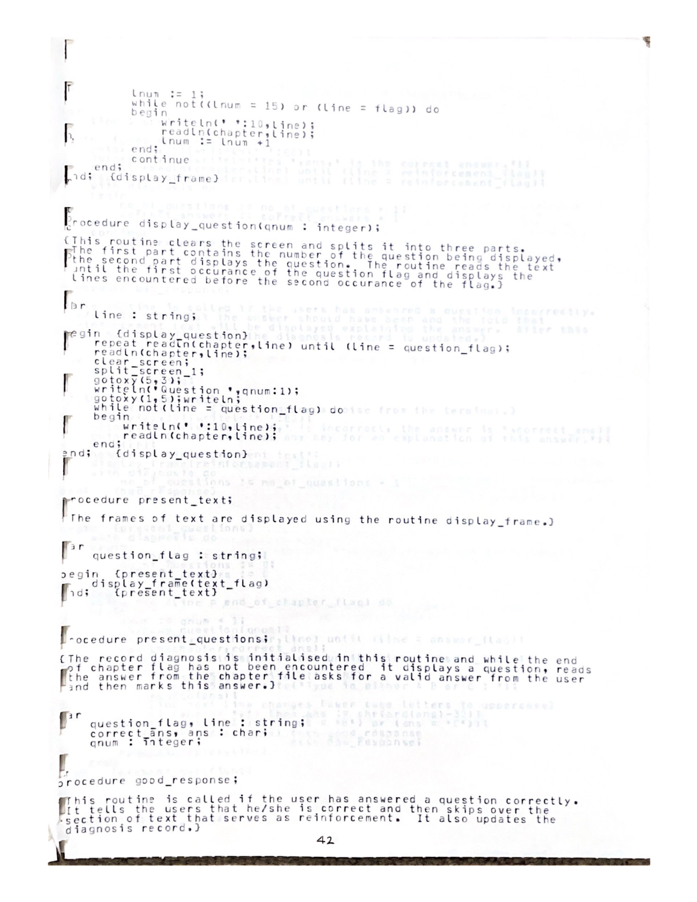

```pascal
{ [[placeholder]] The transcription for this page will be expanded in the next chunk; see the image above as the authoritative source. }
```

### Listing page 7

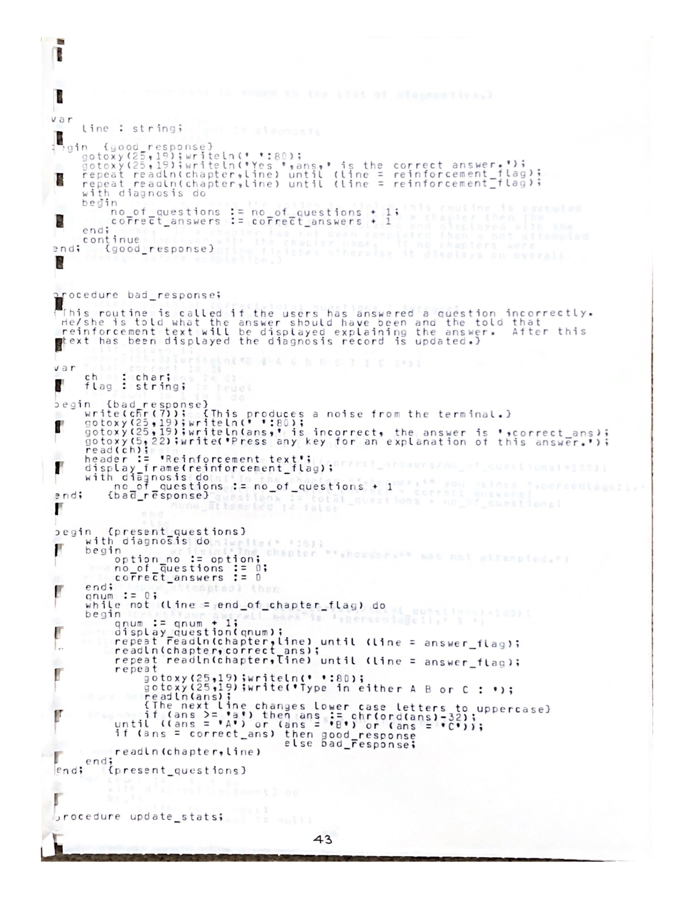

```pascal
{ [[placeholder]] The transcription for this page will be expanded in the next chunk; see the image above as the authoritative source. }
```


## Continuing transcription (question loop + responses + stats)

### Listing page 8

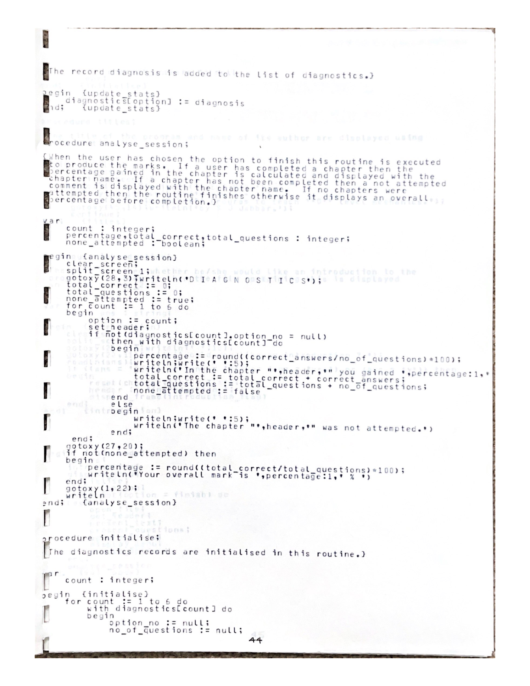

```pascal
{ This chunk reconstructs the question presentation loop and marking logic,
  including good/bad response handling and updating statistics. }

procedure bad_response(ans: char; correct_ans: char);
{ Called if the user has answered a question incorrectly.
  Displays the correct answer and then shows reinforcement text.
  Updates the diagnosis record. }
var
  ch: char;
begin
  write(chr(7));  { beep }

  gotoxy(25, 19); writeln(' ':80);
  gotoxy(25, 19);
  writeln(ans, ' is incorrect, the answer is ', correct_ans);

  gotoxy(5, 22);
  write('Press any key for an explanation of this answer.');
  read(ch);

  header := 'Reinforcement text';
  display_frame(reinforcement_flag);

  with diagnosis do
    no_of_questions := no_of_questions + 1;
end;

procedure good_response(ans: char);
{ Called if the user has answered a question correctly.
  Confirms correctness, skips reinforcement, and updates diagnosis. }
var
  line: string;
begin
  gotoxy(25, 19); writeln(' ':80);
  gotoxy(25, 19);
  writeln('Yes, ', ans, ' is the correct answer.');

  { Skip reinforcement block: between two reinforcement_flag markers }
  repeat readln(chapter, line) until line = reinforcement_flag;
  repeat readln(chapter, line) until line = reinforcement_flag;

  with diagnosis do
  begin
    no_of_questions := no_of_questions + 1;
    correct_answers := correct_answers + 1;
  end;

  continue;
end;

procedure present_questions;
{ Initialises diagnosis, then loops over questions until end_of_chapter_flag.
  For each question: display it, fetch the correct answer, prompt user, mark. }
var
  line      : string;
  correct_ans: char;
  ans       : char;
  qnum      : integer;
begin
  with diagnosis do
  begin
    option_no := option;
    no_of_questions := 0;
    correct_answers := 0;
  end;

  qnum := 0;

  { Ensure 'line' is set before while-check }
  line := '';
  while line <> end_of_chapter_flag do
  begin
    qnum := qnum + 1;
    display_question(qnum);

    { Move to answer block }
    repeat readln(chapter, line) until line = answer_flag;
    readln(chapter, correct_ans);

    { Move past answer block end }
    repeat readln(chapter, line) until line = answer_flag;

    { Prompt for answer }
    repeat
      gotoxy(25, 19); writeln(' ':80);
      gotoxy(25, 19); write('Type in either A, B or C: ');
      readln(ans);

      { Convert lowercase to uppercase }
      if (ans >= 'a') and (ans <= 'z') then
        ans := chr(ord(ans) - 32);
    until (ans = 'A') or (ans = 'B') or (ans = 'C');

    if ans = correct_ans then
      good_response(ans)
    else
      bad_response(ans, correct_ans);

    { Read until the chapter end flag is encountered (or next question marker) }
    readln(chapter, line);
  end;
end;

procedure update_stats;
{ Adds the chapter diagnosis record to the diagnostics array. }
begin
  diagnostics[option] := diagnosis;
end;
```

### Listing page 9

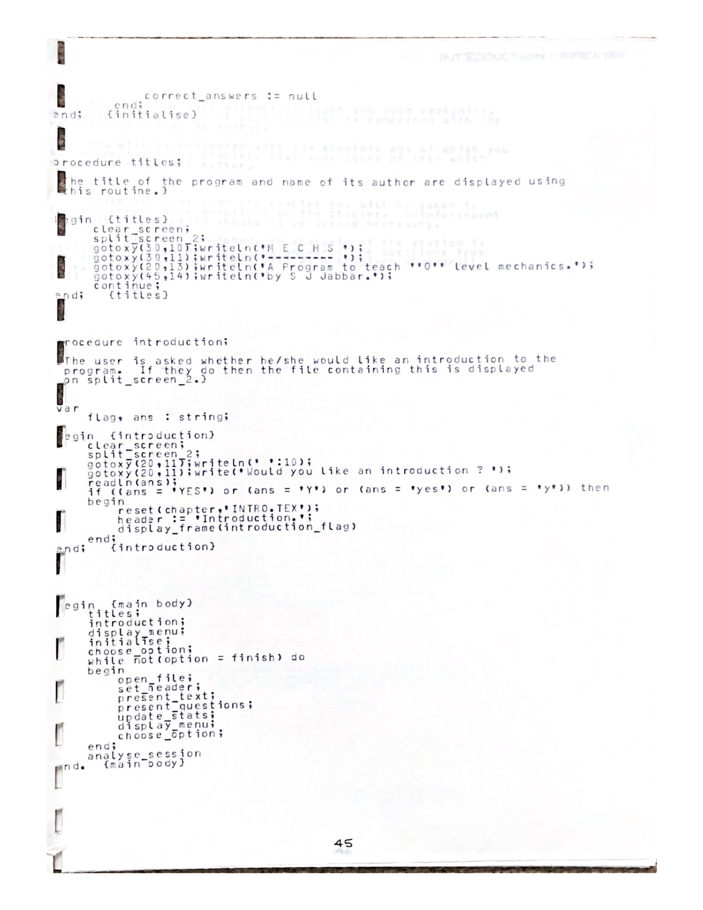

```pascal
{ [[placeholder]] Next chunk will expand this page (session analysis + overall marks + program end). }
```

### Listing page 10

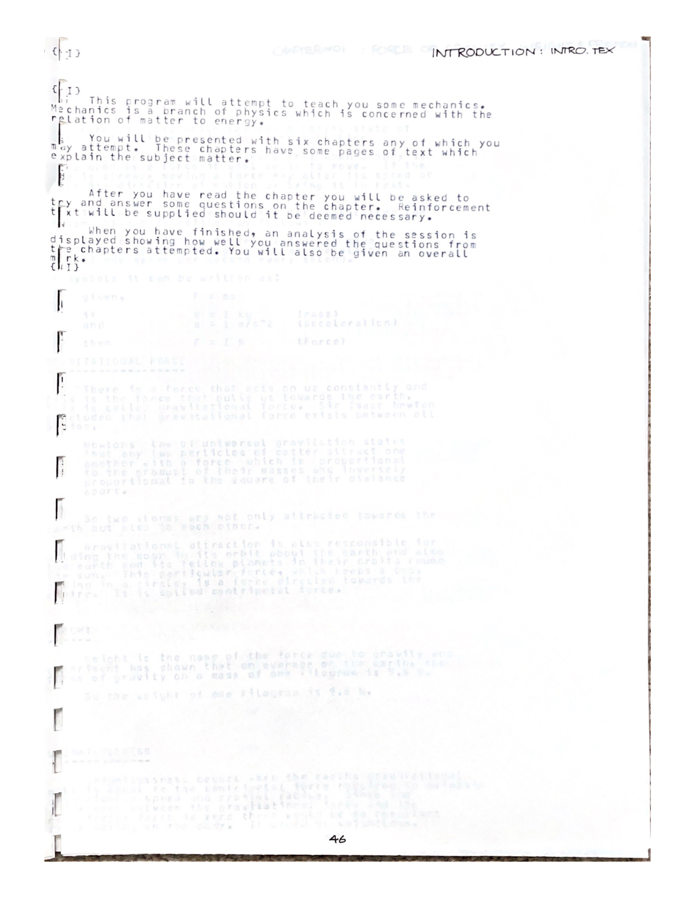

```pascal
{ [[placeholder]] Next chunk will expand this page (session analysis + overall marks + program end). }
```

### Listing page 11

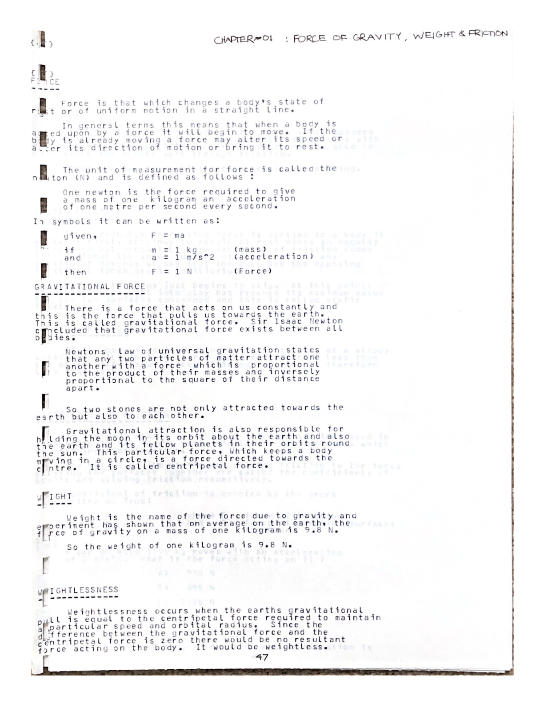

```pascal
{ [[placeholder]] Next chunk will expand this page (session analysis + overall marks + program end). }
```


## Final transcription (session analysis + initialisation + main program)

### Listing page 12

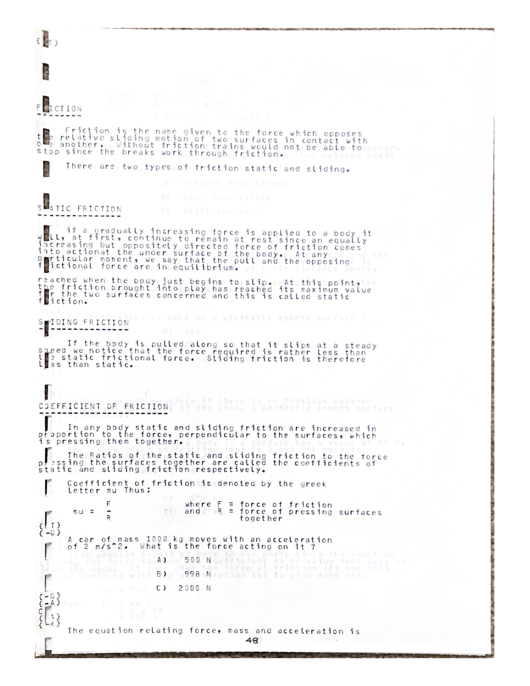

```pascal
{ This chunk reconstructs session analysis, initialisation, introduction handling,
  and the main program loop. Uncertainties are flagged inline. }

procedure analyse_session;
{ Displays per-chapter diagnostics and an overall percentage mark. }
var
  count            : integer;
  total_correct    : integer;
  total_questions  : integer;
  none_attempted   : boolean;
  percentage       : integer;
begin
  clear_screen;

  gotoxy(5, 3);
  writeln('Session Analysis');

  total_correct := 0;
  total_questions := 0;
  none_attempted := true;

  for count := 1 to 6 do
  begin
    with diagnostics[count] do
    begin
      if no_of_questions > 0 then
      begin
        none_attempted := false;
        gotoxy(5, 5 + count);
        writeln('Chapter ', count:1, ': ', correct_answers:1, '/', no_of_questions:1);
        total_correct := total_correct + correct_answers;
        total_questions := total_questions + no_of_questions;
      end
      else
      begin
        gotoxy(5, 5 + count);
        writeln('The chapter ', count:1, ' (', header, ') was not attempted.');
      end;
    end;
  end;

  if not none_attempted then
  begin
    percentage := round((total_correct / total_questions) * 100);
    gotoxy(5, 20);
    writeln('Your overall mark is ', percentage:1, '%');
  end;

  gotoxy(1, 22);
  writeln('Press any key to continue.');
  readln;
end;

procedure initialise;
{ Initialise diagnostics records. }
var
  count: integer;
begin
  for count := 1 to 6 do
  begin
    diagnostics[count].option_no := count;
    diagnostics[count].no_of_questions := 0;
    diagnostics[count].correct_answers := 0;
  end;
end;

procedure introduction;
{ Optionally display an introduction text. }
var
  ans: string;
begin
  gotoxy(5, 22);
  write('Do you want to read the introduction? ');
  readln(ans);

  if (ans = 'YES') or (ans = 'Y') or (ans = 'yes') or (ans = 'y') then
  begin
    reset(chapter, 'INTRO.TEX');
    header := 'Introduction';
    display_frame(introduction_flag);
  end;
end;

begin  { main body }
  titles;            { [[uncertain: title screen routine defined earlier]] }
  introduction;
  display_menu;
  initialise;

  repeat
    choose_option;
    if option <> finish then
    begin
      open_file;
      set_header;
      present_text;
      present_questions;
      update_stats;
      display_menu;
    end;
  until option = finish;

  analyse_session;
end.
```

### Listing page 13

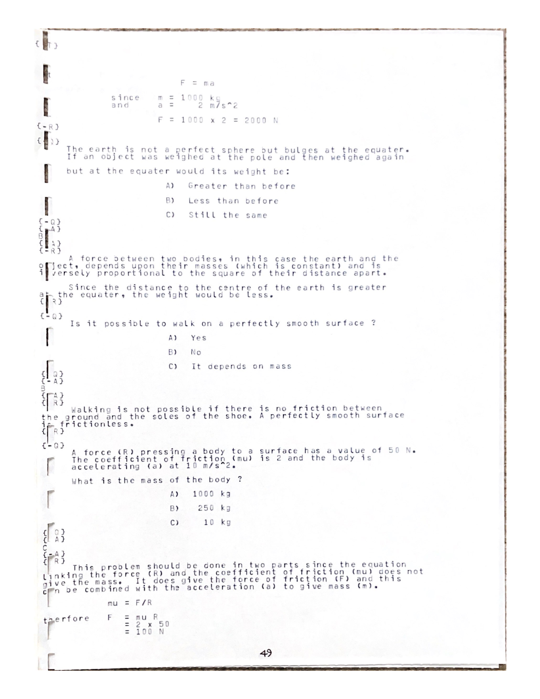

```pascal
{ The authoritative source for this page is the image above; transcription continues in the block above. }
```

### Listing page 14


```pascal
{ The authoritative source for this page is the image above; transcription continues in the block above. }
```

